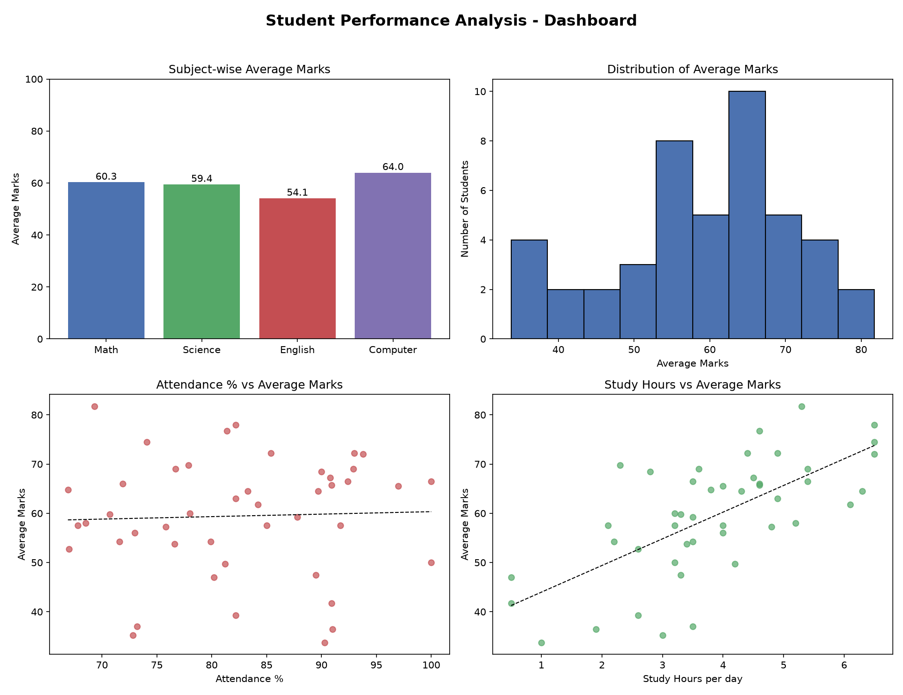

# 📊 Student Performance Data Analysis

A Python console application that cleans, analyzes, and visualizes a
student performance dataset (attendance, study hours, and marks across
four subjects) using **Pandas**, **NumPy**, and **Matplotlib** — driven
entirely through an interactive menu.

---

## 🎯 Objective

To analyze how factors like **attendance** and **study hours** relate
to academic performance, identify top performers and students who
need support, and present the findings through clear statistics and
visualizations.

---

## ✨ Features

- **Data Cleaning**
  - Detects and fills missing values (using column median)
  - Removes duplicate student records
  - Fixes incorrect data types (e.g. `"5.5 hrs"` → `5.5`)
  - Corrects out-of-range values (e.g. attendance > 100%, negative marks)
  - Adds derived columns: `Total_Marks`, `Average_Marks`, `Grade`

- **Data Analysis**
  - Class average, highest & lowest scorer
  - Subject-wise average / highest / lowest marks
  - Top 5 (customizable) students
  - Students needing improvement (customizable threshold)
  - Average attendance & average study hours
  - Correlation between attendance ↔ marks and study hours ↔ marks

- **Visualizations** (saved to `images/charts.png`)
  1. Subject-wise average marks — bar chart
  2. Distribution of average marks — histogram
  3. Attendance % vs average marks — scatter plot (with trend line)
  4. Study hours vs average marks — scatter plot (with trend line)

- **Interactive Menu** — no need to re-run the script for each report

---

## 🛠️ Technologies

- Python 3
- Pandas
- NumPy
- Matplotlib

---

## 📁 Dataset

`students.csv` contains **45–50 student records** with the following columns:

| Column          | Description                          |
|-----------------|---------------------------------------|
| Student_ID      | Unique student identifier             |
| Name            | Student name                          |
| Gender          | Male / Female                         |
| Attendance_%    | Attendance percentage                 |
| Study_Hours     | Average daily study hours             |
| Math_Marks      | Marks in Mathematics                  |
| Science_Marks   | Marks in Science                      |
| English_Marks   | Marks in English                      |
| Computer_Marks  | Marks in Computer Science             |

The dataset intentionally includes a few missing values, one duplicate
row, and a couple of invalid entries (e.g. attendance above 100%) so
the cleaning logic in the program has real issues to fix. A helper
script, `generate_dataset.py`, is included to show how the sample data
was generated (optional — you don't need to run it to use the project).

---

## ▶️ How to Run

1. **Clone the repository**
   ```bash
   git clone https://github.com/<your-username>/Student-Performance-Analysis.git
   cd Student-Performance-Analysis
   ```

2. **Install dependencies**
   ```bash
   pip install -r requirements.txt
   ```

3. **Run the program**
   ```bash
   python student_analysis.py
   ```

4. **Use the menu**
   ```
   ===== STUDENT PERFORMANCE ANALYSIS =====
   1. Show all students
   2. Show class statistics
   3. Show top students
   4. Subject-wise analysis
   5. Find students needing improvement
   6. Analyze attendance
   7. Analyze study hours
   8. Display graphs
   9. Exit
   ```

---

## 📈 Results

On the sample dataset provided:

- **Class average marks:** ~59–60%
- **Best performing subject:** Computer Science
- **Weakest subject:** English
- **Attendance vs Marks correlation:** weak positive relationship
- **Study Hours vs Marks correlation:** moderate–strong positive
  relationship — students who study more consistently score higher,
  more so than attendance alone.

*(Exact numbers will vary slightly since some missing/invalid values
are filled during cleaning.)*

---

## 🖼️ Screenshots

Dashboard of all 4 charts (bar chart, histogram, and two scatter plots
with trend lines):



---

## 🚀 Future Improvements

- Add Seaborn for more polished statistical visuals
- Export analysis results/report to PDF or Excel
- Build a web dashboard version using Streamlit or Flask
- Add gender-based performance comparison
- Support importing live data from Google Sheets / a database
- Add unit tests for the cleaning and analysis functions

---

## 📄 License

This project is open-source and free to use for learning purposes.